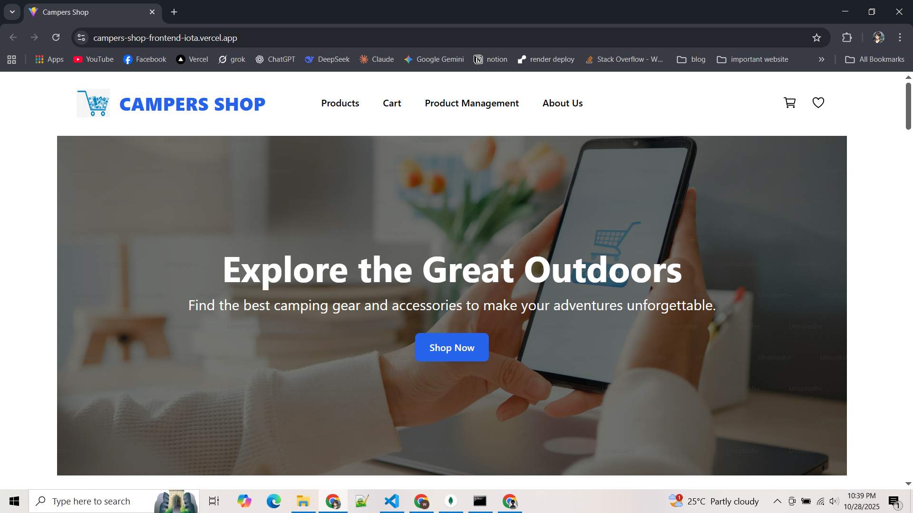
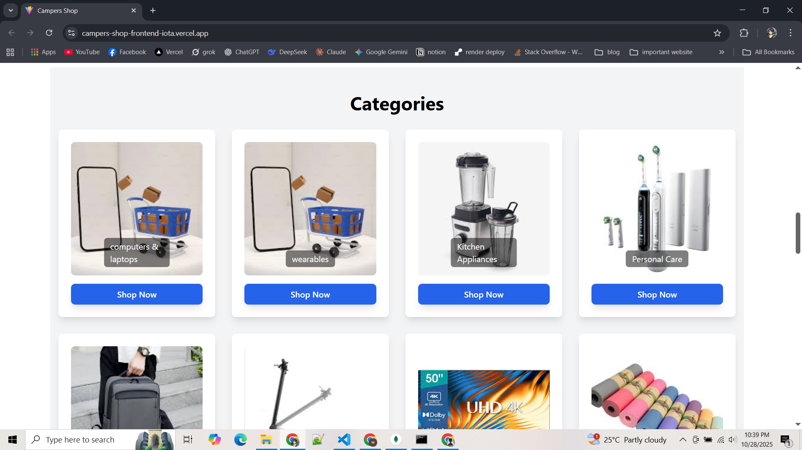
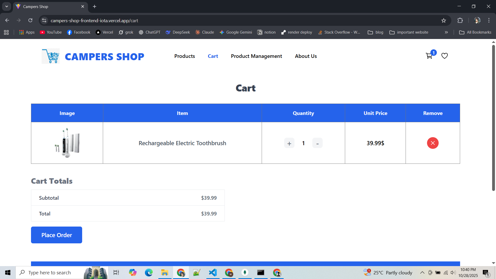

# 🏕️ Campers Shop

### Live Server: [https://campers-shop-frontend-iota.vercel.app](https://campers-shop-frontend-iota.vercel.app)

---

## Overview
Campers Shop is an **e-commerce site** focused on camping products where users can browse, manage, and purchase all essentials for a great camping experience.

---

## Features

- **Product Management:** Create, update, and delete products from the management page.  
- **Filtering & Search:** Filter by price or category, or search for specific items.  
- **Product Details:** Full product details via "See Details" button.  
- **Cart & Orders:** Add items to the cart and place orders.  
- **Checkout:** Enter user information to complete an order.

---

## Technologies Used

**Frontend:**  
- HTML, Tailwind CSS, DaisyUI  
- React, Redux Toolkit  
- TypeScript  
- React Hook Form (forms)  
- React Router DOM (routing)  
- React Slick (carousels)  
- React Icons (icons)  

**State Management:**  
- RTK Query for efficient data fetching and caching  

**Responsive Design:**  
- Fully responsive with pixel-perfect adjustments  

**Error Handling:**  
- Smooth user experience with comprehensive error handling

---

## 🖼️ Project Screenshots

### Homepage & Featured Sections
<p align="center">
  
  
  
</p>

### Categories & Product Details
<p align="center">
  
  
</p>

### Cart & Orders
<p align="center">
  
  
</p>

### Product Management & Testimonials
<p align="center">
  
  
</p>

---

## How to Run Locally

1. **Clone the Repository:**  
```bash
git clone https://github.com/tanzimsiamm/campers-shop-frontend.git
cd campers-shop-frontend
